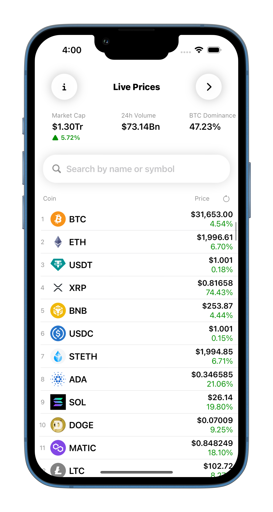
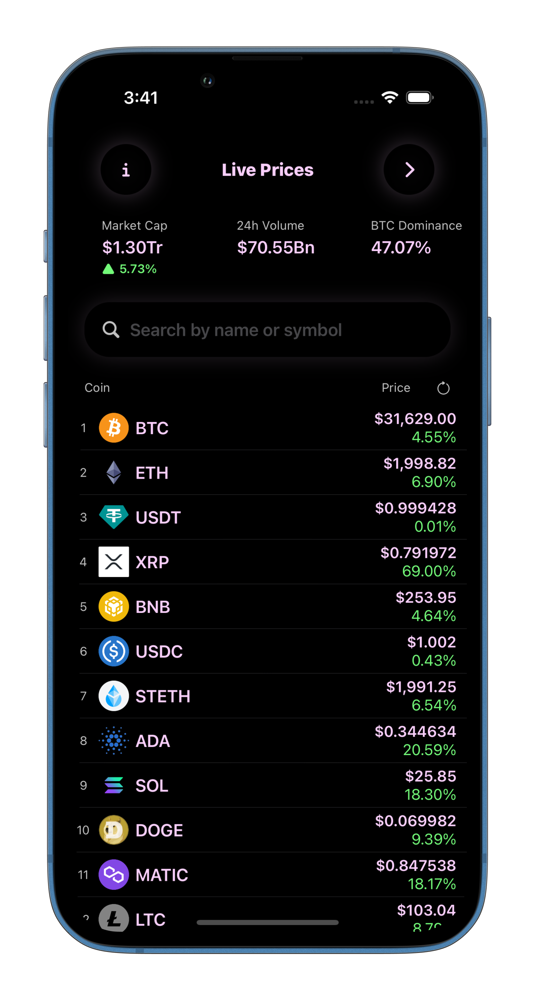
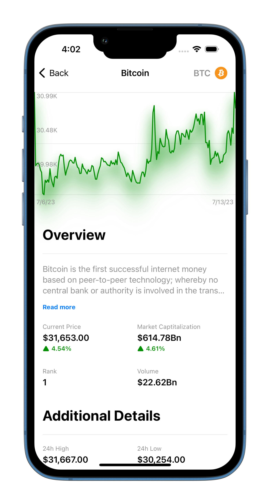
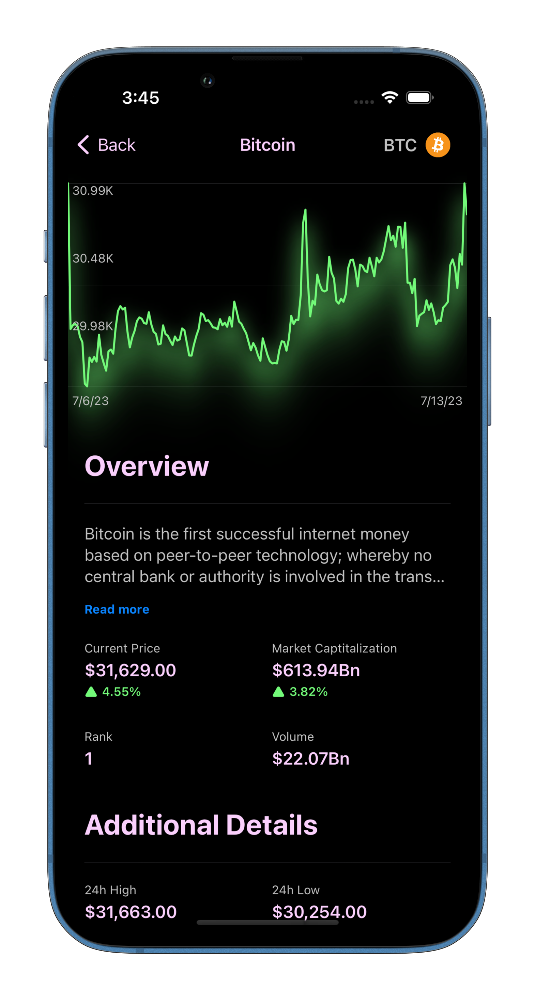
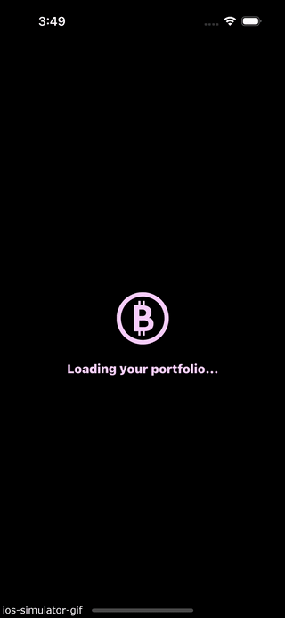
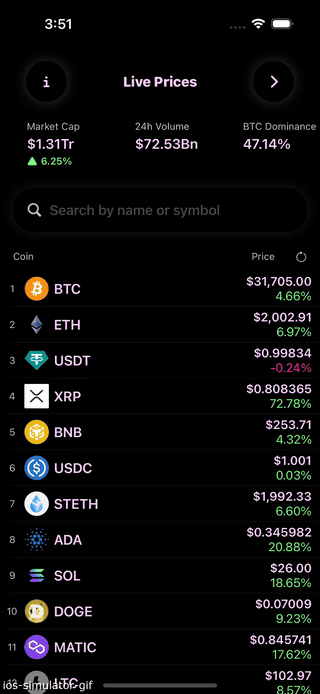
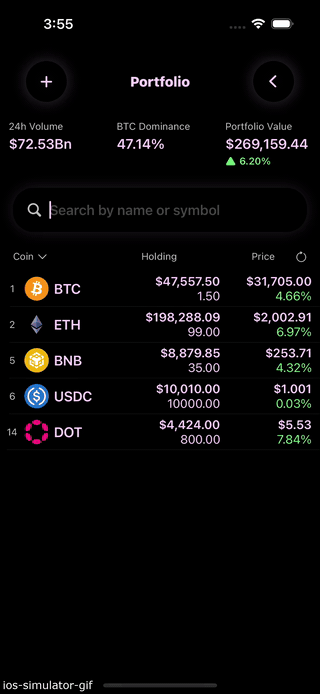
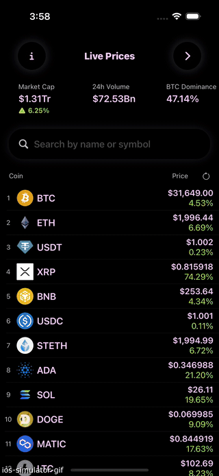

# SwiftUICrypto 

# Description
SwiftUICrypto is a cryptocurrency app that downloads live price data from an API and saves the current user's portfolio.

- SwiftUI
- Combine
- Core Data
- MVVM

# Screenshots
| Light | Dark |
---------|--------
|  | |
|  | |

# More Screenshots
| Launch View | Portfolio View | Detail View | Edit Portfolio | Settings View|
---------|--------|--------|--------|--------|
|  |  |  |   |   |

# Features
- Loading screen animation
- Market statistics section
- Coin price listing with search & filter & sort functionality 
- Add / Edit / Remove coins in your portfolio
- Settings screen for acknowledgments

# Requirements
- iOS 16.0+
- XCode 14.3.1+

# License
MIT License

# Acknowledgments
- [CoinGecko](https://www.coingecko.com/)
- Nick Sarno@[Swiftful Thinking](https://www.swiftful-thinking.com/)

A special thanks to Nick for providing this valuable material. Although it is free, the project tutorial is a true gem on YouTube. It follows the best practices of SwiftUI and Combine.
